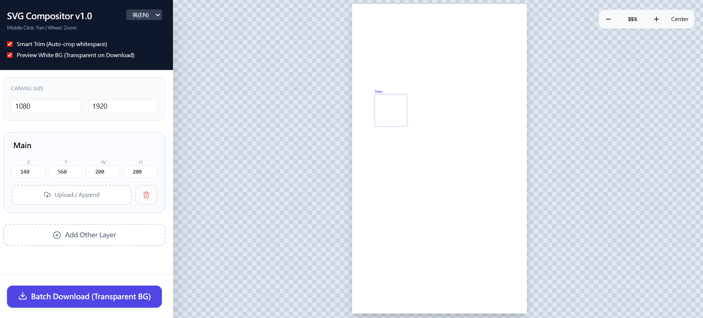

# SVG Compositor v1.0

A powerful, lightweight, browser-based tool for composing, editing, and batch-exporting SVG elements. Built as a **Single File Application** using React—no installation or build steps required.

## ✨ Features

* **Multi‑layer SVG composition**: Manage multiple SVG elements on a virtual canvas.
* **Smart Trim**: Automatically crops whitespace around SVGs upon upload based on bounding boxes.
* **Editable SVG Modal**: Deep edit specific files to select, delete, group, ungroup, or extract parts to new layers.
* **Batch Download**: Automatically exports all variations based on the files in the "Main" layer.
* **Preview Options**: Toggle alignment grid and optional white background (exports remain transparent).
* **Navigation**: Smooth Zoom & Pan controls on both the main canvas and the editor.
* **Multi‑language UI**: Fully localized interface in **繁體中文 (TW)**, **简体中文 (CN)**, and **English (EN)**.

## 🧰 Tech Stack

This project uses a "Zero-Build" architecture. It runs directly in the browser.

* **React 18** (UMD via CDN)
* **ReactDOM 18** (UMD via CDN)
* **Babel Standalone** (Compiles JSX in-browser)
* **Tailwind CSS** (Styling via CDN)
* **Lucide Icons** (Vector icons via CDN)

## 🚀 How to Use

1.  Download the `index.html` file.
2.  Open it in any modern web browser (Chrome, Edge, Safari, Firefox).
3.  Drag and drop SVG files into the layers or use the "Upload" button.

## 🕹️ Controls & Shortcuts

### Main Canvas
| Action | Control |
| :--- | :--- |
| **Pan / Move** | Middle Mouse Drag |
| **Zoom** | Mouse Wheel |
| **Manual Zoom** | Top‑right toolbar buttons |

### SVG Editor Modal
| Action | Control |
| :--- | :--- |
| **Pan / Move** | Middle Mouse Drag |
| **Zoom** | Mouse Wheel |
| **Multi‑select** | Shift + Click |
| **Select All** | `Ctrl` + `A` / `Cmd` + `A` |
| **Group** | `Ctrl` + `G` / `Cmd` + `G` |
| **Ungroup** | `Ctrl` + `Shift` + `G` / `Cmd` + `Shift` + `G` |

## 🧩 How It Works

### Layers (Groups)
The application organizes content into **Layers**. Each layer has:
* **Position**: X, Y coordinates on the canvas.
* **Size**: Width and Height.
* **File List**: A collection of SVG files uploaded to that layer.

### The "Main" Group logic
* **Group 0 (Topmost layer)** is designated as **"Main"**.
* **Batch Export**: When you click "Batch Download", the tool iterates through every file in the Main group.
* **Static Layers**: All other layers (Added Other) remain static. This allows you to place a variable logo (Main) onto a static background (Other) and export all versions at once.

### SVG Editing
If a group contains exactly **1 file**, the "Edit SVG" button becomes active. inside the editor:
1.  **Cleanup**: Delete unwanted paths or elements.
2.  **Grouping**: Organize loose paths into Groups (`<g>`) for easier management.
3.  **Extraction**: Select a specific part of an SVG and click **"Extract to New Layer"**. This moves the selected element out of the current file and creates a new Layer on the main canvas with that element.

## 📤 Export Details

* **Batch Download**: Generates one `.svg` file for every file present in the Main Group.
* **Background**: Exports always use a **Transparent** background, even if "Preview White BG" is enabled in the UI.

## ⚠️ Notes / Limitations

* **Performance**: SVG parsing and rendering are done in-browser. Extremely large or complex SVG files (MBs in size) may cause UI lag.
* **Smart Trim**: Relies on `getBBox()`. If the SVG has complex clipping paths or masks, the trim might differ slightly from visual bounds.
* **File Type**: Currently, only `.svg` files are supported.

## Author

Created by **@Rock_4762**